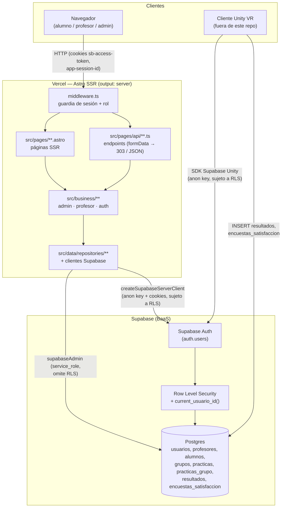

# Documentación del Proyecto — FiberLab VR Dashboard

> Generado a partir de una lectura exhaustiva del código fuente el 2026-08-14. Todo lo marcado con **⚠️ por confirmar** no pudo verificarse con certeza desde el repositorio y debe revisarse manualmente.

## Índice

1. [Reconocimiento general](#1-reconocimiento-general)
2. [Stack tecnológico](#2-stack-tecnológico)
3. [Arquitectura](#3-arquitectura)
4. [Estructura de archivos (mapa completo)](#4-estructura-de-archivos-mapa-completo)
5. [Funcionalidades del sitio](#5-funcionalidades-del-sitio)
   - [5.1 Páginas / rutas](#51-páginas--rutas)
   - [5.2 Endpoints API](#52-endpoints-api)
   - [5.3 Componentes y módulos reutilizables](#53-componentes-y-módulos-reutilizables)
6. [Configuración y entorno](#6-configuración-y-entorno)
7. [Modelo de datos](#7-modelo-de-datos)
8. [Dependencias y flujo de build/deploy](#8-dependencias-y-flujo-de-builddeploy)
9. [Huecos y dudas](#9-huecos-y-dudas)

---

## 1. Reconocimiento general

**Qué es:** `dashboard-web` (nombre en `package.json`) es el **panel de administración web de FiberLab VR**, una plataforma educativa de realidad virtual para prácticas de fibra óptica. El repositorio implementa únicamente el **backend/dashboard SSR** (Astro + Supabase); la experiencia de realidad virtual en sí (Unity) **no vive en este repositorio** — se comunica con la misma base de datos Supabase de forma independiente.

**Para qué sirve / problema que resuelve** (deducido de `README.md`, `CLAUDE.md`, `src/doc/CONTRATO_VR.md` y el código):

- Gestiona el **registro y aprobación de profesores** (flujo `pendiente → aprobado/rechazado`, solo un admin puede aprobar).
- Gestiona el **registro de alumnos**, su ingreso a **grupos** mediante un código de acceso de 5 caracteres, y el CRUD administrativo de alumnos/profesores.
- Permite a los **profesores** crear/dar de baja grupos, **asignar prácticas** de fibra óptica a sus grupos, ver la lista de alumnos y **calificar** los resultados que la app VR (Unity) escribió directamente en Supabase.
- Permite al **administrador** aprobar/rechazar profesores, gestionar alumnos y profesores, y ver una **agregación de las encuestas de satisfacción** que los alumnos responden dentro de la app VR (promedios, distribuciones, sin desglose por alumno).
- El proyecto es, en esencia, la **capa administrativa y de calificación** de un ecosistema donde Unity (cliente VR, fuera de este repo) es la fuente de datos de resultados y encuestas, y este dashboard es donde profesores/administradores consumen y gestionan esos datos.

Institución: el branding (logos IPN/UPIITA en `public/images/`) indica que el proyecto pertenece a un contexto académico del **IPN — UPIITA** (Instituto Politécnico Nacional, México).

---

## 2. Stack tecnológico

### Lenguajes y frameworks

| Tecnología | Versión (`package.json`) | Uso |
|---|---|---|
| [Astro](https://astro.build) | `^6.1.8` | Framework principal — SSR, páginas `.astro`, endpoints API |
| TypeScript | vía `astro/tsconfigs/strict` (`tsconfig.json`) | Tipado en business/data/utils y frontmatter de `.astro` |
| `@astrojs/vercel` | `^10.0.4` | Adaptador de despliegue serverless para Vercel |
| `@supabase/supabase-js` | `^2.99.0` | Cliente Supabase (admin y público) |
| `@supabase/ssr` | `^0.10.3` | Cliente Supabase con manejo de cookies para SSR |

### Testing

| Herramienta | Versión | Uso |
|---|---|---|
| Vitest | `^3.2.4` | Tests unitarios (`src/tests/unit/`) |
| Playwright (`@playwright/test`) | `^1.60.0` | Tests e2e (`src/tests/e2e/`) — **corren contra la URL de producción**, ver §9 |

### Despliegue

- **Vercel**, mediante `output: 'server'` + `@astrojs/vercel()` en `astro.config.mjs` — cada ruta es SSR (no hay build estático).
- URL de producción confirmada (usada literalmente en los specs e2e): `https://dashboard-web-six-umber.vercel.app`.
- Existe una carpeta `.vercel/` local (proyecto vinculado a Vercel vía CLI), pero su `project.json` no está poblado/leíble en este checkout — ⚠️ por confirmar el Project ID exacto de Vercel.
- No hay `vercel.json`, `Dockerfile` ni `netlify.toml` — el despliegue depende enteramente del adaptador de Astro y la configuración del proyecto en el dashboard de Vercel.
- No se encontró configuración de CI/CD (no hay carpeta `.github/workflows`) — ⚠️ por confirmar si el despliegue es automático vía integración Git de Vercel o manual.

### Base de datos y servicios externos

- **Supabase** (Postgres + Auth + Row Level Security) — única base de datos y proveedor de autenticación. Ver `src/doc/database/schema.sql` (fuente de verdad) y §7 de este documento.
- **Cliente Unity VR** — no está en este repo, pero es un consumidor/productor de datos vía el SDK de Supabase para Unity, documentado en `src/doc/CONTRATO_VR.md`. Escribe en las tablas `resultados` y (por contrato) `encuestas_satisfaccion` usando la clave `anon` sujeta a RLS.
- No hay integración con pasarelas de pago, servicios de email transaccional propios (Supabase Auth gestiona el envío de correos de confirmación/recuperación) ni otros SaaS externos detectados.

---

## 3. Arquitectura

**Tipo:** Aplicación **server-rendered (SSR) monolítica** con arquitectura en 3 capas estrictas (presentación → negocio → datos), desplegada como funciones serverless en Vercel. No es SPA: no hay framework de UI en cliente (React/Vue/etc.), toda la interactividad es HTML + `<script>` vanilla/TS embebidos por página (`src/presentation/scripts/`, `public/script/`).

```
src/
├── presentation/   # Astro components, layouts, CSS, scripts de cliente
├── business/       # Lógica de dominio, agrupada por rol (admin, profesor, auth)
├── data/           # Acceso a Supabase — clientes + repositorios por entidad
├── pages/          # Rutas de archivo de Astro (páginas + API)
├── middleware.ts   # Guardia de rutas — valida sesión y rol en cada request
└── utils/          # Helpers compartidos
```

Regla de capas (documentada en `CLAUDE.md` y `src/doc/database/database-context.md`): **el flujo de datos es top-down** — páginas llaman a servicios de negocio, servicios llaman a repositorios, repositorios hablan con Supabase directamente y nunca contienen reglas de negocio.

### Diagrama de componentes



**Puntos clave del diagrama:**
- Dos vías de acceso a Supabase desde el dashboard: el **cliente SSR** (`createSupabaseServerClient`, anon key, sujeto a RLS, usado para login/registro/recuperación de contraseña) y el **cliente admin** (`supabaseAdmin`, service role, usado en casi todos los repositorios para lecturas/escrituras privilegiadas del lado admin/profesor).
- Unity nunca pasa por este servidor Astro — escribe/lee Supabase directamente con la clave `anon`, protegido solo por RLS.

### Flujo de datos de punta a punta — caso de uso principal

El caso de uso central del sistema es **"un alumno hace una práctica en VR y un profesor la califica desde el dashboard"**:

1. El alumno realiza la práctica en la app Unity VR (fuera de este repo). Al terminar, Unity inserta una fila en `resultados` (`alumno_id`, `practica_id`, `respuestas_json`, `tiempo_segundos`) directamente en Supabase con la clave `anon`, protegido por la policy `alumno_inserta_su_resultado`.
2. El profesor inicia sesión (`POST /api/auth/signin` → `src/pages/api/auth/signin.ts`), que valida credenciales contra Supabase Auth, genera un `sessionId` propio y lo guarda tanto en la cookie `app-session-id` como en `usuarios.active_session_uuid` (control de sesión única por dispositivo).
3. El profesor navega a `/dashboard/profesor/calificar`. `src/middleware.ts` valida la sesión (`sessionService.getValidatedSession`, que compara el JWT de Supabase **y** el `app-session-id` contra la DB) y el rol (`profesor`, `estado: aprobado`) antes de renderizar la página.
4. La página (`src/pages/dashboard/profesor/calificar.astro`) llama a `alumnoService.getStudentsByTeacher()`, que a su vez consulta en paralelo `grupoRepository`, `alumnoRepository`, `resultadoRepository`, `practicaRepository` y `userRepository` (todos vía `supabaseAdmin`) para armar la tabla de alumnos/resultados del grupo.
5. El profesor pulsa "Calificar"; `public/script/calificarModal.js` abre un modal, construye un input por pregunta a partir de `respuestas_json` (contrato en `src/doc/CONTRATO_VR.md`) y calcula la calificación final en tiempo real (promedio × 10).
6. Al guardar, el script hace `fetch POST /api/profesor/calificar` con JSON `{ alumno_id, practica_id, calificacion, respuestas_json }`. El endpoint (`src/pages/api/profesor/calificar.ts`) valida el payload, verifica ownership (`teacherOwnsResult`: el alumno pertenece a un grupo del profesor **y** el resultado existe) y llama a `resultadoRepository.updateResultado`, que hace `UPDATE resultados SET calificacion, respuestas_json WHERE alumno_id AND practica_id`.
7. La página se recarga (`location.reload()`) mostrando la calificación actualizada. El alumno, por su parte, puede ver su propia calificación vía RLS (`alumno_ver_resultados`) — aunque no hay una vista de alumno en este dashboard (los alumnos no tienen acceso al panel web, solo a la app VR).

---

## 4. Estructura de archivos (mapa completo)

### Árbol de directorios

```text
Dashboard_PT2/
├── .claude/
│   └── settings.local.json              # permisos locales de Claude Code para este repo
├── .vscode/
│   ├── extensions.json                  # recomienda la extensión astro-build.astro-vscode
│   └── launch.json                      # tarea de VS Code para "astro dev"
├── docs/
│   └── superpowers/
│       ├── plans/                       # planes de implementación (feature planning docs)
│       │   ├── 2026-07-15-privacy-policy-page.md
│       │   └── 2026-07-20-admin-feedback-dashboard.md
│       └── specs/                       # specs de diseño aprobadas
│           ├── 2026-07-15-privacy-policy-page-design.md
│           └── 2026-07-20-admin-feedback-dashboard-design.md
├── public/
│   ├── favicon.ico / favicon.svg
│   ├── images/                          # logos (FiberLab, IPN, UPIITA), iconos de UI
│   └── script/
│       ├── calificarModal.js            # ★ lógica del modal de calificación (profesor)
│       └── register-form.js             # ★ validación de contraseñas en el form de registro
├── src/
│   ├── business/                        # ── CAPA DE NEGOCIO ──
│   │   ├── admin/
│   │   │   ├── adminService.ts          # CRUD de profesores/alumnos para el admin
│   │   │   ├── feedbackService.ts       # agregación de encuestas_satisfaccion (promedios, distribución)
│   │   │   └── studentService.ts        # listado/filtro de alumnos para el admin
│   │   ├── auth/
│   │   │   ├── authService.ts           # registro multi-paso con rollback (Auth + usuarios + subtipo)
│   │   │   ├── authValidator.ts         # validación de payload de registro
│   │   │   ├── redirects.ts             # getSafeRedirectPath — previene open redirect
│   │   │   ├── requireProfesor.ts       # guard reutilizable (⚠️ ver §9 — no referenciado)
│   │   │   ├── sessionCookies.ts        # opciones y limpieza de cookies de sesión
│   │   │   ├── sessionService.ts        # getValidatedSession — valida JWT + sesión única
│   │   │   └── userRoleService.ts       # getUserRole — resuelve admin/profesor desde auth_uid
│   │   └── profesor/
│   │       ├── alumnoService.ts         # alumnos + resultados + calificaciones de un profesor
│   │       ├── asignacionService.ts     # asignar prácticas a grupos, listar asignadas
│   │       ├── grupoService.ts          # alta/baja de grupos, código de acceso, ciclo escolar
│   │       ├── practicaService.ts       # listar prácticas activas
│   │       ├── profesorService.ts       # estadísticas del dashboard del profesor
│   │       └── studentListService.ts    # lista simple de alumnos de un grupo
│   ├── data/                            # ── CAPA DE DATOS ──
│   │   ├── client/
│   │   │   ├── supabase.ts              # createSupabaseServerClient (anon key, cookies, SSR)
│   │   │   └── supabaseAdmin.ts         # cliente service_role (omite RLS)
│   │   └── repositories/                # un repositorio por entidad — sin lógica de negocio
│   │       ├── alumnoRepository.ts
│   │       ├── asignacionRepository.ts
│   │       ├── feedbackRepository.ts
│   │       ├── grupoRepository.ts
│   │       ├── practicaRepository.ts
│   │       ├── profesorRepository.ts
│   │       ├── resultadoRepository.ts
│   │       ├── studentRepository.ts
│   │       └── userRepository.ts
│   ├── doc/                             # documentación de dominio versionada con el código
│   │   ├── CONTRATO_VR.md               # contrato de datos Unity ↔ Dashboard (tabla resultados)
│   │   └── database/
│   │       ├── database-context.md      # contexto de arquitectura de datos para Claude Code
│   │       ├── database-rules.md        # reglas de negocio referenciadas por CLAUDE.md
│   │       └── schema.sql               # ★ fuente de verdad del esquema (tablas, RLS, funciones)
│   ├── pages/                           # ── RUTAS (file-based routing de Astro) ──
│   │   ├── api/                         # endpoints — ver §5.2
│   │   │   ├── admin/  (5 archivos)
│   │   │   ├── auth/   (6 archivos)
│   │   │   └── profesor/ (3 archivos)
│   │   ├── auth/                        # páginas públicas de autenticación — ver §5.1
│   │   ├── dashboard/
│   │   │   ├── admin.astro + admin/     # panel admin — ver §5.1
│   │   │   └── profesor.astro + profesor/ # panel profesor — ver §5.1
│   │   ├── legal/privacidad.astro       # política de privacidad (contenido estático)
│   │   ├── register/                    # pantallas de resultado de registro (éxito/error)
│   │   └── index.astro                  # ★ ENTRY POINT — login (ruta "/")
│   ├── presentation/                    # ── CAPA DE PRESENTACIÓN ──
│   │   ├── components/
│   │   │   ├── admin/UserEditor.astro   # formulario genérico de edición (alumno/profesor)
│   │   │   ├── auth/RegisterForm.astro  # formulario de registro compartido alumno/profesor
│   │   │   ├── dashboard/Header.astro + Sidebar.astro
│   │   │   ├── profesor/GrupoSelector.astro + TeacherSection.astro
│   │   │   └── ui/                      # Alert, InputField, PasswordField, Toast + modals/
│   │   ├── layouts/
│   │   │   ├── Layout.astro             # layout base (HTML shell, fuente Inter)
│   │   │   ├── AuthLayout.astro         # envuelve Layout con tarjeta centrada (login/auth)
│   │   │   └── DashboardLayout.astro    # envuelve Layout con Sidebar + Header
│   │   ├── scripts/
│   │   │   ├── adminModals.ts           # abre/cierra modales de aprobar/rechazar profesor
│   │   │   └── modal.ts                 # openModal/closeModal genéricos (ES module)
│   │   └── styles/                      # CSS plano por página/sección (sin Tailwind ni CSS-in-JS)
│   │       ├── auth.css / dashboard.css / global.css
│   │       ├── legal.css / profesor.css / register.css
│   │       └── variables.css            # design tokens (colores, spacing, fuentes)
│   ├── tests/
│   │   ├── e2e/                         # Playwright — ver §5 y §9 (corren contra producción)
│   │   └── unit/                        # Vitest — admin/, auth/, profesor/
│   ├── env.d.ts                         # tipos de import.meta.env + App.Locals
│   └── middleware.ts                    # ★ guardia de rutas — se ejecuta en cada request
├── astro.config.mjs                     # output: 'server' + adaptador Vercel
├── CLAUDE.md                            # guía para Claude Code en este repo
├── package.json
├── playwright.config.ts                 # testDir: src/tests/e2e (sin baseURL — URLs hardcodeadas)
├── README.md
├── tsconfig.json                        # extiende astro/tsconfigs/strict
└── vitest.config.ts                     # incluye src/tests/**/*.test.ts
```

*(Se excluyeron del árbol: `node_modules/`, `.git/`, `dist/`, `.astro/`, `.vercel/` internos, `test-results/`, `package-lock.json`, `.DS_Store`, por ser generados/no relevantes para entender la arquitectura.)*

### Puntos de entrada (entry points)

| Archivo | Rol |
|---|---|
| `src/pages/index.astro` | Entry point de la app — ruta `/`, formulario de login. Si ya hay sesión válida, redirige según rol. |
| `src/middleware.ts` | Se ejecuta en **todas** las requests antes que cualquier página/endpoint — es el punto de entrada real de la lógica de autorización. |
| `astro.config.mjs` | Entry point de configuración del framework — define el modo de renderizado y el adaptador de despliegue. |
| `src/pages/api/**/*.ts` | Cada archivo es un entry point HTTP independiente (una función serverless por endpoint bajo Vercel). |

---

## 5. Funcionalidades del sitio

### 5.1 Páginas / rutas

| Ruta | Archivo | Acceso | Qué hace |
|---|---|---|---|
| `/` | `src/pages/index.astro` | Público | Login. Si hay sesión válida redirige a `/dashboard/admin` o `/dashboard/profesor` según rol. Muestra alertas de error (`credenciales`, `no_access`, `pendiente`, `rechazado`) y de confirmación de correo. |
| `/auth/confirm` | `src/pages/auth/confirm.astro` | Público | Página puente sin UI: lee el `#hash` que Supabase Auth agrega al redirigir tras confirmar email o recuperar contraseña, y redirige a `/?confirmed=1` o `/auth/update-password` con cookies del token de recuperación. |
| `/auth/forgot-password` | `src/pages/auth/forgot-password.astro` | Público | Formulario para solicitar email de recuperación de contraseña. |
| `/auth/register` | `src/pages/auth/register.astro` | Público | Registro de **alumno** (usa `RegisterForm` con `userType="student"`). |
| `/auth/register-teacher` | `src/pages/auth/register-teacher.astro` | Público | Registro de **profesor** (`RegisterForm` con `userType="teacher"`). |
| `/auth/update-password` | `src/pages/auth/update-password.astro` | Público (requiere token de recuperación en cookies) | Formulario para establecer nueva contraseña tras recuperación. |
| `/legal/privacidad` | `src/pages/legal/privacidad.astro` | Público | Política de privacidad — contenido 100% estático, sin lógica ni acceso a datos. |
| `/register/success` | `src/pages/register/success.astro` | Público | Pantalla de éxito tras registro; enlaza a login y a volver a registrarse. |
| `/register/error` | `src/pages/register/error.astro` | Público | Pantalla de error tras registro fallido (`reason=email`\|`duplicate`). |
| `/dashboard/admin` | `src/pages/dashboard/admin.astro` | Admin | Tabla de solicitudes de profesores **pendientes**, con acciones "Dar de alta" / "Rechazar" (abren modales). |
| `/dashboard/admin/profesores` | `src/pages/dashboard/admin/profesores.astro` | Admin | Lista paginada + búsqueda de profesores; modo edición vía `?matricula=` (editar datos o dar de baja). |
| `/dashboard/admin/alumnos` | `src/pages/dashboard/admin/alumnos.astro` | Admin | Filtro por ciclo escolar + grupo, lista paginada de alumnos; modo edición vía `?boleta=`. |
| `/dashboard/admin/feedback` | `src/pages/dashboard/admin/feedback.astro` | Admin | Estadísticas agregadas de `encuestas_satisfaccion` (promedios tipo Likert, ritmo, % de recomendación) — sin desglose por alumno. |
| `/dashboard/profesor` | `src/pages/dashboard/profesor.astro` | Profesor aprobado | Home del profesor: conteo de grupos/prácticas/alumnos + accesos rápidos a crear grupo y asignar práctica. |
| `/dashboard/profesor/gestionar-grupos` | `src/pages/dashboard/profesor/gestionar-grupos.astro` | Profesor aprobado | Alta/baja de grupos por nombre; muestra el código de acceso del grupo seleccionado. |
| `/dashboard/profesor/asignar` | `src/pages/dashboard/profesor/asignar.astro` | Profesor aprobado | Formulario para asignar una práctica a un grupo con fecha límite. |
| `/dashboard/profesor/alumnos` | `src/pages/dashboard/profesor/alumnos.astro` | Profesor aprobado | Lista de alumnos de un grupo seleccionado (`GrupoSelector`). |
| `/dashboard/profesor/calificar` | `src/pages/dashboard/profesor/calificar.astro` | Profesor aprobado | Tabla de resultados por grupo/práctica con botón "Calificar"/"Editar" que abre el modal de calificación pregunta por pregunta. |

Todas las rutas bajo `/dashboard/admin*` y `/dashboard/profesor*` (páginas y API) están protegidas por `src/middleware.ts`, que valida sesión + rol + (para profesor) `estado: aprobado` antes de dejar pasar la request.

### 5.2 Endpoints API

Todos residen en `src/pages/api/`. Patrón general: leen `request.formData()` (excepto `calificar.ts`, que recibe JSON), llaman a un servicio de negocio, y devuelven un **303 redirect** o **JSON** (`apiOk`/`apiError`/`apiRedirect` de `src/utils/apiResponse.ts`, o `Response` construidas a mano en los de `auth/`).

| Método | Ruta | Auth | Recibe (formData / JSON) | Devuelve |
|---|---|---|---|---|
| `POST` | `/api/auth/signin` | Público | `email`, `password` | 302 a `/dashboard/admin`, `/dashboard/profesor` o `/?error=...`. Setea cookies `sb-access-token`, `sb-refresh-token`, `app-session-id`; sobreescribe `usuarios.active_session_uuid` (invalida otras sesiones del mismo usuario). |
| `POST` | `/api/auth/signout` | Cualquiera con sesión | — | Invalida el token en Supabase Auth, limpia todas las cookies de sesión, 302 a `/`. |
| `POST` | `/api/auth/register` | Público | `nombre`, `apellidoPaterno`, `apellidoMaterno`, `email`, `password`, `passwordConfirm`, `role`, `boleta?`, `matricula?` | Redirige a `/register/success?type=...` o `/register/error?reason=email\|duplicate\|unknown&type=...`. |
| `POST` | `/api/auth/reset-password` | Público | `email` | 302 a `/auth/forgot-password?message=sent` (Supabase envía el correo) o `?error=1`. |
| `POST` | `/api/auth/update-password` | Requiere sesión de recuperación en cookies | `password`, `passwordConfirm` | Valida longitud mínima (8) y coincidencia; 302 a `/auth/update-password?success=1` o con `error=password_corto\|no_coinciden\|misma_contrasena\|error_actualizacion`. |
| `GET` | `/api/auth/callback` | Público | Query `code`, `next?` | Intercambia el código PKCE de Supabase por una sesión (`exchangeCodeForSession`) y redirige a `next` (validado con `getSafeRedirectPath`) o a `/auth/forgot-password?error=link_expirado\|link_invalido`. |
| `POST` | `/api/admin/update-teacher-status` | Admin | `profesor_id`, `estado` (`pendiente`\|`aprobado`\|`rechazado`) | 303 a `/dashboard/admin`. |
| `POST` | `/api/admin/update-teacher` | Admin | `profesor_id`, `nombre`, `apellido_paterno`, `apellido_materno`, `matricula_trabajador`, `redirect?` | 303 al `redirect` (o `?error=campos_vacios\|matricula_duplicada\|actualizacion`). |
| `POST` | `/api/admin/delete-teacher` | Admin | `profesor_id`, `redirect?` | 303 con `?deleted=1`. Borra en cascada vía `usuarios` (FK `ON DELETE CASCADE`). |
| `POST` | `/api/admin/update-student` | Admin | `alumno_id`, `nombre`, `apellido_paterno`, `apellido_materno`, `boleta`, `redirect?` | 303 al `redirect` (o `?error=campos_vacios\|boleta_duplicada\|actualizacion`). |
| `POST` | `/api/admin/delete-student` | Admin | `alumno_id`, `redirect?` | 303 con `?deleted=1`. |
| `POST` | `/api/profesor/gestionar-grupos` | Profesor aprobado | `grupo` (nombre), `action` (`alta`\|`baja`) | 303 con `?success=alta\|baja\|alta_existe\|baja_error\|reactivado`. |
| `POST` | `/api/profesor/asignar` | Profesor aprobado | `practica_id`, `grupo_id`, `fecha_fin` | 303 con `?success=asignacion` o `?error=campos\|1`. Valida que `fecha_fin` no sea pasada y que el grupo pertenezca al profesor. |
| `POST` | `/api/profesor/calificar` | Profesor aprobado (verificado dos veces: middleware + check inline de `estado === "aprobado"`) | JSON `{ alumno_id, practica_id, calificacion: number (0-10), respuestas_json? }` | JSON `{ ok: true, data }` (200) o `{ error }` (400/403/404/500). Verifica *ownership* (el alumno debe pertenecer a un grupo del profesor y el resultado debe existir) antes de actualizar. |

Todos los endpoints bajo `/api/admin/*` y `/api/profesor/*` están cubiertos por `middleware.ts`: sin sesión válida devuelven `401 { ok:false, error:"No autenticado" }`; con rol incorrecto, `403`. Los endpoints de `/api/admin/*` **además** repiten la validación de sesión/rol dentro del propio handler (defensa en profundidad); los de `/api/profesor/*` confían en `Astro.locals.roleData` inyectado por el middleware.

### 5.3 Componentes y módulos reutilizables clave

| Componente/módulo | Ubicación | Propósito |
|---|---|---|
| `Layout.astro` / `AuthLayout.astro` / `DashboardLayout.astro` | `src/presentation/layouts/` | Cadena de layouts: shell HTML base → tarjeta centrada (auth) → sidebar+header (dashboards). |
| `UserEditor.astro` | `src/presentation/components/admin/` | Formulario genérico de alta/edición/baja reutilizado por las vistas de profesores y alumnos del admin (parametrizado por `idField`, `identifierField`, `updateAction`, `deleteAction`). |
| `RegisterForm.astro` | `src/presentation/components/auth/` | Un solo formulario de registro que cambia campos (`boleta` vs `matricula`) según `userType`; usado por `/auth/register` y `/auth/register-teacher`. |
| `Sidebar.astro` | `src/presentation/components/dashboard/` | Menú de navegación por rol (`menuByRole`), resalta la ruta activa, incluye botón de logout (`POST /api/auth/signout`). |
| `GrupoSelector.astro` | `src/presentation/components/profesor/` | `<select>` reutilizable que sincroniza el grupo elegido con `?grupo=` en la URL (usado en alumnos, calificar, gestionar-grupos). |
| `TeacherSection.astro` | `src/presentation/components/profesor/` | Wrapper de sección con título/descripción para las páginas del profesor. |
| `Alert.astro`, `Toast.astro` | `src/presentation/components/ui/` | Feedback de UI — `Alert` para mensajes en formularios, `Toast` para notificaciones flotantes autodestruibles que además limpian los query params de la URL. |
| `InputField.astro`, `PasswordField.astro` | `src/presentation/components/ui/` | Campos de formulario estándar; `PasswordField` incluye toggle de mostrar/ocultar contraseña. |
| `ApproveTeacherModal` / `RejectTeacherModal` / `ConfirmDeleteModal` | `src/presentation/components/ui/modals/` | Modales de confirmación reutilizados en flujos administrativos destructivos/sensibles. |
| `modal.ts` / `adminModals.ts` | `src/presentation/scripts/` | Lógica vanilla de abrir/cerrar modales; `adminModals.ts` cablea los botones de aprobar/rechazar profesor a sus modales. |
| `calificarModal.js` | `public/script/` | Módulo más complejo del frontend: construye dinámicamente un input por pregunta desde `respuestas_json`, calcula la calificación (promedio × 10) en tiempo real, y hace el `fetch` a `/api/profesor/calificar`. |
| `apiResponse.ts` | `src/utils/` | Helpers `apiOk`/`apiError`/`apiRedirect` para respuestas homogéneas en los endpoints API. |
| `usuario.ts` | `src/utils/` | `buildNombreCompleto` — concatena nombre + apellidos filtrando vacíos. |

---

## 6. Configuración y entorno

### Variables de entorno

Declaradas en `src/env.d.ts` y usadas vía `import.meta.env`. **No se listan valores reales** — solo nombres y propósito.

| Variable | Alcance | Usada en | Propósito |
|---|---|---|---|
| `PUBLIC_SUPABASE_URL` | Público (cliente + servidor) | `src/data/client/supabase.ts`, `supabaseAdmin.ts`, `authService.ts`, `sessionCookies.ts` | URL del proyecto Supabase. |
| `PUBLIC_SUPABASE_ANON_KEY` | Público | `src/data/client/supabase.ts`, `authService.ts` (cliente público de registro) | Clave anónima, sujeta a RLS — usada para login, registro (signUp) y flujos de recuperación de contraseña. |
| `SUPABASE_SERVICE_ROLE_KEY` | **Solo servidor** | `src/data/client/supabaseAdmin.ts` | Clave de rol de servicio — omite RLS. Usada en casi todos los repositorios y en operaciones administrativas (aprobar profesores, rollback de registro, etc.). Nunca debe exponerse al cliente. |

⚠️ **Por confirmar:** el archivo `.env.example` que `README.md` y `CLAUDE.md` referencian como plantilla **no existe actualmente en el árbol de trabajo** (aparece como borrado en `git status` al momento de esta documentación: `D .env.example`). El archivo `.env.local` local sí existe y contiene las tres variables de arriba (valores no expuestos aquí). Recomendado: restaurar `.env.example` (`git checkout -- .env.example` o recrearlo) para no romper el flujo de onboarding descrito en el README.

### Scripts de npm

| Script | Comando | Qué hace |
|---|---|---|
| `npm run dev` | `astro dev` | Servidor de desarrollo en `http://localhost:4321`. |
| `npm run build` | `astro build` | Build de producción (SSR — genera funciones para el adaptador de Vercel). |
| `npm run preview` | `astro preview` | Sirve el build de producción localmente. |
| `npm run astro` | `astro` | Acceso directo al CLI de Astro (`astro add`, `astro check`, etc.). |
| `npm run test` | `vitest run` | Corre una vez todos los tests unitarios (`src/tests/**/*.test.ts`). |
| `npm run test:watch` | `vitest` | Tests unitarios en modo watch. |
| *(sin script npm dedicado)* | `npx playwright test` | Corre los tests e2e — **⚠️ actualmente apuntan a la URL de producción** `https://dashboard-web-six-umber.vercel.app` (hardcodeada en cada spec), no a `localhost` ni a un `baseURL` configurable. Ver §9. |

### Pasos para levantar el proyecto en local desde cero

1. `git clone https://github.com/IvanRamirezz/Dashboard_PT2.git && cd Dashboard_PT2`
2. `npm install`
3. Crear `.env.local` en la raíz con las tres variables de la tabla anterior, apuntando a un proyecto Supabase que tenga el esquema de `src/doc/database/schema.sql` aplicado (tablas, RLS, funciones `current_usuario_id()` y `get_auth_uid_by_email()`).
4. En el dashboard de Supabase → Authentication → URL Configuration, agregar `http://localhost:4321/auth/update-password` (y el equivalente de producción) a las redirect URLs permitidas.
5. `npm run dev` → abrir `http://localhost:4321`.
6. Para tests unitarios: `npm run test`. Para e2e: revisar primero `src/tests/e2e/*.spec.ts`, ya que apuntan a producción y no a local (ver ⚠️ en §9) — habría que parametrizar la URL o ejecutar manualmente contra el entorno deseado.

---

## 7. Modelo de datos

Fuente de verdad: `src/doc/database/schema.sql` (Postgres/Supabase). Reglas de negocio complementarias en `src/doc/database/database-rules.md`. Contrato específico de la tabla `resultados` con el cliente Unity en `src/doc/CONTRATO_VR.md`.

### Enums

- `estado_aprobacion`: `pendiente` | `aprobado` | `rechazado` (usado en `profesores.estado`).

### Tablas

| Tabla | Columnas clave | Relaciones |
|---|---|---|
| `usuarios` | `usuario_id` PK, `nombre`, `apellido_paterno`, `apellido_materno`, `auth_uid` (UNIQUE, FK → `auth.users`), `active_session_uuid`, `created_at` | Tabla base de identidad — todos los roles cuelgan de aquí vía `usuario_id` compartido. |
| `profesores` | `profesor_id` PK **=** FK → `usuarios.usuario_id`, `matricula_trabajador` (UNIQUE), `estado` (`estado_aprobacion`, default `pendiente`) | Extiende `usuarios` (relación 1-a-1 por PK compartida). |
| `administrador` | `admin_id` PK = FK → `usuarios.usuario_id` | Extiende `usuarios`. |
| `alumnos` | `alumno_id` PK = FK → `usuarios.usuario_id`, `boleta` (UNIQUE), `grupo_id` FK → `grupos` (`ON DELETE SET NULL`) | Extiende `usuarios`; pertenece opcionalmente a un `grupo`. |
| `grupos` | `grupo_id` PK, `nombre`, `codigo_acceso` (UNIQUE), `ciclo_escolar`, `profesor_id` FK → `profesores`, `activo` (default `true`) | Pertenece a un profesor; tiene muchos alumnos y prácticas asignadas. |
| `practicas` | `practica_id` PK, `titulo`, `descripcion`, `activo` | Catálogo de prácticas; se asignan a grupos vía `practicas_grupo`. |
| `practicas_grupo` | `asignacion_id` PK, `grupo_id` FK → `grupos` (`CASCADE`), `practica_id` FK → `practicas` (`CASCADE`), `fecha_inicio`, `fecha_fin` | Tabla puente N:M entre `grupos` y `practicas`. |
| `resultados` | `resultado_id` PK, `alumno_id` FK → `alumnos` (`CASCADE`), `practica_id` FK → `practicas` (`CASCADE`), `calificacion` (`NUMERIC(4,2)`, null hasta calificar), `respuestas_json` (`JSONB`), `created_at`. `UNIQUE(alumno_id, practica_id)` | Un alumno tiene a lo más un resultado por práctica. **Ver ⚠️ en §9 sobre la columna `tiempo_segundos`.** |
| `encuestas_satisfaccion` | `encuesta_id` PK, `alumno_id` (UNIQUE, FK → `alumnos`, `CASCADE`), `respuestas_json` (`JSONB`, no null), `created_at` | Una encuesta por alumno (no por práctica) — experiencia general de la app. |

### Funciones SQL clave

- `current_usuario_id()` — `SECURITY DEFINER`, mapea `auth.uid()` → `usuarios.usuario_id`. Es la base de casi todas las policies RLS.
- `get_auth_uid_by_email(p_email TEXT)` — `SECURITY DEFINER`, resuelve un email a su UUID en `auth.users` sin necesidad de `listUsers()` paginado; usado en `authService.ts` para detectar emails duplicados y recuperar el `authUid` tras un `signUp`.

### Row Level Security (resumen por tabla)

| Tabla | Policies relevantes |
|---|---|
| `usuarios` | El usuario ve/inserta/actualiza (para `active_session_uuid`) solo su propio registro (`auth_uid = auth.uid()`); el profesor puede ver los `usuarios` de los alumnos de sus grupos. |
| `profesores` | El profesor ve solo su propio registro. (No hay policy de SELECT para admin — el admin lee vía `supabaseAdmin`.) |
| `grupos` | Profesor inserta grupos solo si está `aprobado`; actualiza/elimina solo sus propios grupos; cualquier autenticado puede leer grupos `activo = true` (necesario para que el alumno se una por código). |
| `alumnos` | El alumno ve y actualiza su propio `grupo_id` (unirse con código); el profesor ve los alumnos de sus grupos. |
| `practicas` | Cualquier autenticado ve prácticas `activo = true`. |
| `practicas_grupo` | El alumno ve las prácticas de su propio grupo; el profesor inserta asignaciones solo en sus propios grupos. |
| `resultados` | El alumno inserta y ve solo su propio resultado; el profesor ve y actualiza (`calificacion`) solo resultados de alumnos de sus grupos. |
| `encuestas_satisfaccion` | El alumno inserta (una sola vez, por el `UNIQUE`) y ve solo su propia encuesta. **Sin policy de SELECT para admin** — el panel de administrador lee con `supabaseAdmin` (service role), documentado explícitamente en el propio `schema.sql`. |

### Diagrama entidad-relación

```mermaid
erDiagram
    usuarios ||--o| profesores : "extiende (PK compartida)"
    usuarios ||--o| administrador : "extiende (PK compartida)"
    usuarios ||--o| alumnos : "extiende (PK compartida)"
    profesores ||--o{ grupos : "dicta"
    grupos ||--o{ alumnos : "contiene"
    grupos ||--o{ practicas_grupo : "tiene asignadas"
    practicas ||--o{ practicas_grupo : "se asigna a"
    alumnos ||--o{ resultados : "obtiene"
    practicas ||--o{ resultados : "genera"
    alumnos ||--o| encuestas_satisfaccion : "responde"

    usuarios {
        int usuario_id PK
        varchar nombre
        varchar apellido_paterno
        varchar apellido_materno
        uuid auth_uid UK
        uuid active_session_uuid
    }
    profesores {
        int profesor_id PK_FK
        varchar matricula_trabajador UK
        enum estado
    }
    administrador {
        int admin_id PK_FK
    }
    alumnos {
        int alumno_id PK_FK
        varchar boleta UK
        int grupo_id FK
    }
    grupos {
        int grupo_id PK
        varchar nombre
        varchar codigo_acceso UK
        varchar ciclo_escolar
        int profesor_id FK
        bool activo
    }
    practicas {
        int practica_id PK
        varchar titulo
        text descripcion
        bool activo
    }
    practicas_grupo {
        int asignacion_id PK
        int grupo_id FK
        int practica_id FK
        timestamp fecha_inicio
        timestamp fecha_fin
    }
    resultados {
        int resultado_id PK
        int alumno_id FK
        int practica_id FK
        numeric calificacion
        jsonb respuestas_json
    }
    encuestas_satisfaccion {
        int encuesta_id PK
        int alumno_id FK_UK
        jsonb respuestas_json
    }
```

### Contrato `respuestas_json`

- **`resultados.respuestas_json`** (escrito por Unity, actualizado por el dashboard al calificar): Unity escribe `{ "pregunta_N": "texto de respuesta" }`; el dashboard, al calificar, lo transforma a `{ "pregunta_N": { "respuesta": "...", "calificacion": 0-1 } }`. Documentado en `src/doc/CONTRATO_VR.md`.
- **`encuestas_satisfaccion.respuestas_json`** (escrito por Unity, contrato fijo): `{ navegacion: 1-5, instrucciones: 1-5, ritmo: "muy_lento"|"adecuado"|"muy_rapido", claridad_tema: 1-5, recomendaria: boolean }`. Documentado al final de `schema.sql` y en `src/business/admin/feedbackService.ts` (que ignora silenciosamente cualquier valor fuera de este contrato, fila por fila, sin romper el resto del cálculo).

---

## 8. Dependencias y flujo de build/deploy

### Build

1. `npm run build` ejecuta `astro build`.
2. Con `output: 'server'` (en `astro.config.mjs`), Astro genera funciones serverless (no HTML estático) para cada página y endpoint API, empaquetadas para el runtime del adaptador `@astrojs/vercel`.
3. No hay pasos de build adicionales (sin Tailwind, sin bundler de assets más allá del pipeline nativo de Astro/Vite).

### Deploy

- Objetivo: **Vercel**. El adaptador (`vercel()` sin opciones adicionales en `astro.config.mjs`) es responsable de traducir la salida de Astro al formato de Vercel Functions.
- URL de producción confirmada (hardcodeada en los tests e2e): `https://dashboard-web-six-umber.vercel.app`.
- No se encontró pipeline de CI/CD en el repo (`.github/workflows` no existe) — el despliegue probablemente ocurre por la integración nativa Git↔Vercel (push a la rama conectada dispara build+deploy automático), pero esto es ⚠️ por confirmar, ya que no hay evidencia directa en el repositorio de esa configuración (vive en el dashboard de Vercel, fuera del código).
- Variables de entorno de producción (`PUBLIC_SUPABASE_URL`, `PUBLIC_SUPABASE_ANON_KEY`, `SUPABASE_SERVICE_ROLE_KEY`) deben configurarse en el proyecto de Vercel — no están en el repo (correcto, por seguridad).

### Dependencias externas críticas (sin las cuales el proyecto no funciona)

- **Supabase** — sin un proyecto Supabase con el esquema de `schema.sql` aplicado (tablas + RLS + las dos funciones SQL), la app no puede autenticar ni leer/escribir ningún dato. Es una dependencia dura, no solo de datos sino de la lógica de autorización (RLS complementa al middleware de Astro).
- **`@astrojs/vercel`** — sin este adaptador, `output: 'server'` no tiene a dónde compilar; sería necesario cambiar de adaptador para desplegar en otra plataforma.
- **Cliente Unity VR (externo)** — el dashboard depende de que Unity inserte filas en `resultados` y `encuestas_satisfaccion` respetando el contrato de `CONTRATO_VR.md`; si Unity cambia el formato de `respuestas_json` sin coordinarse, rompe `calificarModal.js` y/o `feedbackService.ts`.
- **Fuente Google Fonts (Inter)** — cargada vía `<link>` externo en `Layout.astro`; si Google Fonts no está disponible, degrada a la fuente por defecto del navegador (no bloqueante, pero es una dependencia de red en cada carga de página).

---

## 9. Huecos y dudas

Elementos que no se pudieron determinar con certeza desde el código, o inconsistencias detectadas que conviene revisar manualmente:

1. **⚠️ Discrepancia en la tabla `resultados`: falta la columna `tiempo_segundos`.** El `CREATE TABLE resultados` en `src/doc/database/schema.sql` (líneas ~55-63) **no incluye** una columna `tiempo_segundos`, pero:
   - `src/doc/CONTRATO_VR.md` la documenta como columna obligatoria que Unity debe escribir.
   - El propio `schema.sql` incluye, al final del archivo, un `INSERT INTO resultados (..., tiempo_segundos) VALUES (...)` de ejemplo que la usa.
   - Ningún repositorio del dashboard (`resultadoRepository.ts`) la lee ni la escribe.
   Hay que confirmar contra la base de datos Supabase real si la columna existe (fue añadida manualmente y no reflejada en el `CREATE TABLE`, como ya ocurrió con `encuestas_satisfaccion` según su propio plan de implementación) y, si existe, actualizar `schema.sql` para que sea la fuente de verdad real.

2. **⚠️ `src/business/auth/requireProfesor.ts` no parece estar importado desde ningún lugar** de las páginas/endpoints revisados (las páginas de profesor leen `Astro.locals.roleData`, ya poblado por el middleware, en vez de llamar a este helper). Confirmar si es código muerto o si se usa en algún flujo no cubierto por esta lectura (p. ej. un archivo no localizado, o trabajo en progreso).

3. **⚠️ Los tests e2e (`src/tests/e2e/*.spec.ts`) apuntan a la URL de producción** (`https://dashboard-web-six-umber.vercel.app`) hardcodeada, no a `localhost` ni a una variable de entorno/`baseURL` de Playwright. Esto significa que correr `npx playwright test` localmente ejecuta contra el entorno **productivo** real, con las credenciales que sea que estén hardcodeadas dentro de cada spec (no inspeccionadas en detalle aquí más allá de las URLs). Confirmar si esto es intencional (smoke tests post-deploy) o una deuda técnica pendiente de parametrizar.

4. **⚠️ `.env.example` no existe en el árbol de trabajo actual** (aparece borrado en `git status`), aunque `README.md` y `CLAUDE.md` instruyen a copiarlo para el setup local. Confirmar si fue un borrado intencional reciente o accidental.

5. **⚠️ Pipeline de CI/CD no está en el repositorio.** No hay `.github/workflows/`, `vercel.json` con `builds`/`github` config, ni ningún otro archivo de automatización de deploy. Se asume integración nativa Vercel↔GitHub configurada fuera del repo, pero no se pudo confirmar.

6. **⚠️ Confirmación de email / SMTP:** el flujo de registro (`authService.ts`) usa `supabase.auth.signUp` con `emailRedirectTo`, lo que implica que Supabase Auth está configurado para exigir confirmación de correo antes de poder iniciar sesión (hay incluso un test e2e — `register-alumno.spec.ts` — que verifica justo esto). La configuración de la plantilla de correo / proveedor SMTP vive en el dashboard de Supabase y no es inspeccionable desde este repo.

7. **⚠️ Vinculación exacta del proyecto Vercel:** existe una carpeta `.vercel/` local indicando que el repo está vinculado a un proyecto de Vercel vía CLI, pero `project.json` no contenía datos legibles en este checkout. El Project ID/Org ID de Vercel no se pudo confirmar desde el código.

8. **Nota, no bloqueante:** `astro.config.mjs` no fija ninguna opción adicional en `vercel()` (ni `imageService`, ni `edgeMiddleware`, ni runtime específico) — usa los defaults del adaptador. Igualmente el proyecto no declara un campo `engines` en `package.json`; el `README.md` solo *recomienda* Node 24 sin forzarlo.

9. **Nota, no bloqueante:** no se encontró ningún archivo de configuración de linting (ESLint/Biome) ni de formateo (Prettier) en la raíz del proyecto — el estilo de código se mantiene por convención, no por tooling automatizado.
